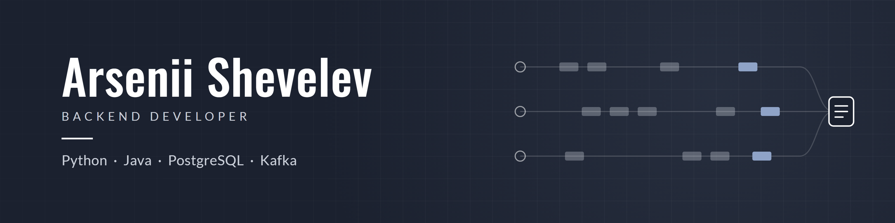

  

  
  
  

## About me

I'm a backend developer in Finland with three years of full-time experience across three companies. Most of my work is in Python and Java, with PostgreSQL and Kafka underneath.

> Most of my professional code lives in private company repositories, so the projects here are ones I build on my own time.

## Tech stack

<table>
  <tr>
    <td align="center" width="25%"><b>Languages</b></td>
    <td align="center" width="25%"><b>Backend</b></td>
    <td align="center" width="25%"><b>Data and messaging</b></td>
    <td align="center" width="25%"><b>Tooling</b></td>
  </tr>
  <tr>
    <td align="center">
      <picture>
        <source media="(prefers-color-scheme: dark)" srcset="https://skillicons.dev/icons?i=python%2Cjava&theme=dark">
        
      </picture>
    </td>
    <td align="center">
      <picture>
        <source media="(prefers-color-scheme: dark)" srcset="https://skillicons.dev/icons?i=fastapi%2Cflask%2Cgraphql&theme=dark">
        
      </picture>
    </td>
    <td align="center">
      <picture>
        <source media="(prefers-color-scheme: dark)" srcset="https://skillicons.dev/icons?i=postgres%2Ckafka&theme=dark">
        
      </picture>
    </td>
    <td align="center">
      <picture>
        <source media="(prefers-color-scheme: dark)" srcset="https://skillicons.dev/icons?i=docker%2Cgit%2Cgithubactions%2Clinux&theme=dark">
        
      </picture>
    </td>
  </tr>
</table>

Also: asyncio, SQLAlchemy, Pydantic, WebSockets, REST, pytest, JUnit 5, Maven, TDD.

## Experience

| When | Role | What I worked on |
|---|---|---|
| 2026 | **Software Engineering Intern** · Multitude, Helsinki | Backend test automation in Java 21 and JUnit 5 for a loan platform built on microservices, Kafka and a GraphQL API |
| 2024‑25 | **Backend Engineer Intern** · Bridge, remote | FastAPI and Flask microservices, PostgreSQL schemas, real-time messaging and presence over WebSockets |
| 2023‑24 | **Junior Full Stack Developer** · Carisbrooke Shipping, remote | Flask applications, PostgreSQL query optimization, Python scripts that automated manual workflows |

<!--
## Featured project

Uncomment and fill in once the project repository is public.

| Project | What it shows |
|---|---|
| [shipment-events](https://github.com/USERNAME/shipment-events) | FastAPI, Kafka, PostgreSQL and WebSockets in an event-driven service, tested with real containers and run in GitHub Actions |
-->

## Get in touch

The fastest way to reach me is [LinkedIn](https://www.linkedin.com/in/arsenii-shevelev) or [email](mailto:arsenii.shev04@gmail.com).
